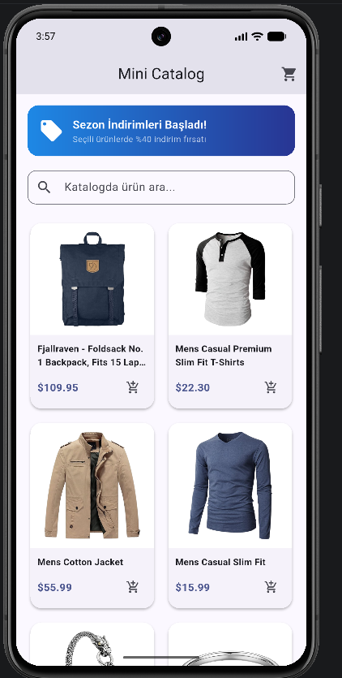
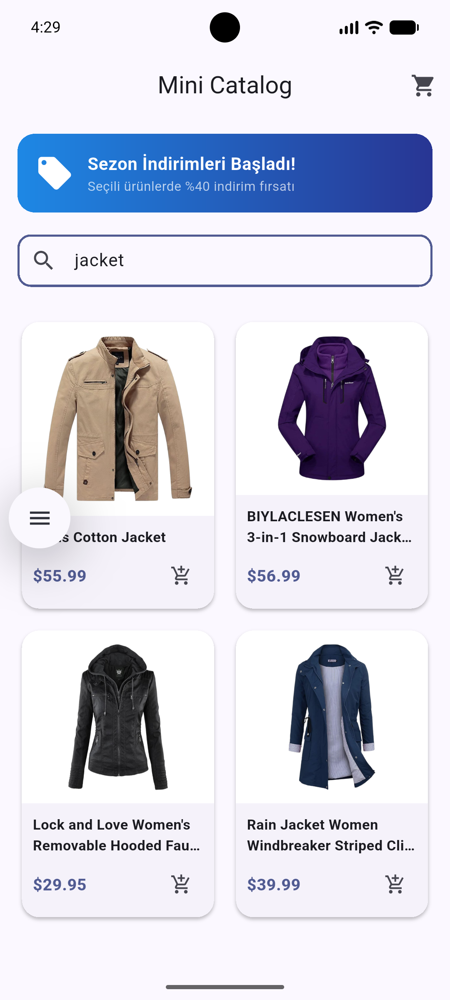
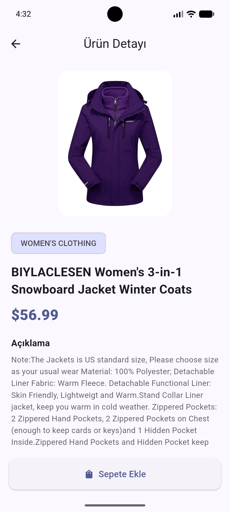
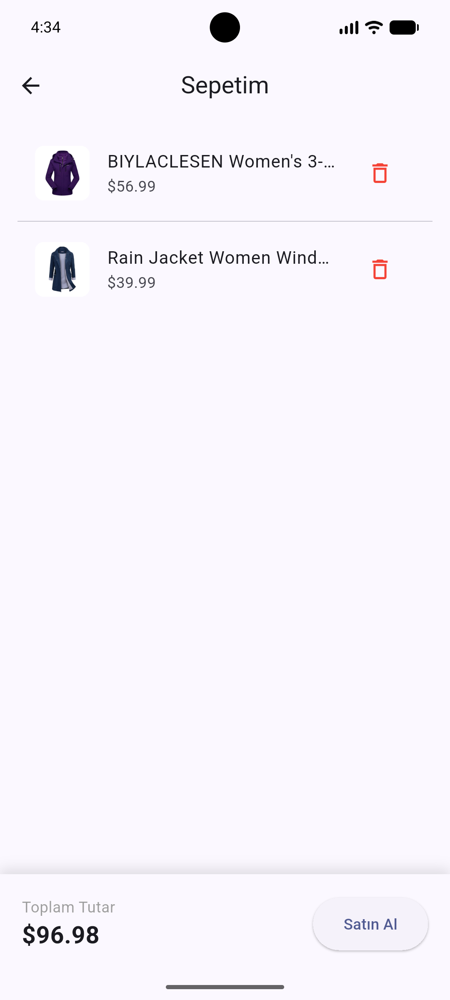

<h1 align="center">MINI CATALOG - Flutter Mobile Application</h1>

<p align="center">
  
  
  
  
  
</p>

<p align="center">
  <a href="#english">English</a> | <a href="#türkçe">Türkçe</a>
</p>

---

##  Screenshots / Ekran Görüntüleri

| Catalog Home / Ana Katalog | Real-Time Search / Canlı Arama | Product Detail / Ürün Detayı | Cart / Sepet Yönetimi |
| :---: | :---: | :---: | :---: |
|  |  |  |  |

---

<div id="english"></div>

# 🇬🇧 English

## Overview
**Mini Catalog** is a modern, responsive mobile e-commerce catalog application built with **Flutter** and **Dart**. The project fetches dynamic product data from the **FakeStore REST API** and demonstrates enterprise-level clean architecture, asynchronous state management, real-time filtering, and Material 3 design standards.

##  Key & Extra Features
- **Live REST API Integration:** Fetches remote catalog products asynchronously from `fakestoreapi.com/products` via HTTP GET and deserializes JSON data into type-safe models.
- **Real-Time Search & Filtering:** Dynamic local filtering across product titles with immediate UI feedback and custom empty-state handling.
- **Product Detail Navigation:** Deep screen navigation passing typed product entities with high-resolution images, category chips, and formatted descriptions.
- **Interactive Cart State Management:** Full shopping cart operations (add/remove), responsive badge counter on the App Bar, and real-time total price calculation.
- **User Feedback & UX:** Contextual `SnackBar` notifications confirming item additions and checkout completion.
- **Clean Architecture & Code Standards:** Decoupled modular structure (`models/`, `screens/`, `widgets/`) with **0 warnings** on `flutter analyze`.

##  Tech Stack
- **Framework:** Flutter (Material 3)
- **Language:** Dart
- **Networking:** `http: ^1.6.0`
- **State Management:** Reactive local state (`StatefulWidget`, callbacks)

##  Project Structure
```text
lib/
├── models/
│   └── product.dart        # Type-safe Product model and JSON serializer
├── screens/
│   ├── catalog_screen.dart # Home catalog screen with search and promo banner
│   ├── detail_screen.dart  # Product detail view with full description
│   └── cart_screen.dart    # Cart listing and dynamic total checkout view
├── widgets/
│   └── product_card.dart   # Modular grid product card component
└── main.dart               # App configuration and Material 3 theme setup
```

##  Installation & Setup
```bash
# Clone repository
git clone [https://github.com/KULLANICI_ADIN/mini-catalog-flutter.git](https://github.com/KULLANICI_ADIN/mini-catalog-flutter.git)

# Enter project directory
cd mini-catalog-flutter

# Get dependencies
flutter pub get

# Run application
flutter run
```

---

<div id="türkçe"></div>

# 🇹🇷 Türkçe

## Genel Bakış
**Mini Catalog**, **Flutter** ve **Dart** kullanılarak geliştirilmiş modern, responsive bir mobil e-ticaret katalog uygulamasıdır. Proje, statik sahte veriler yerine **FakeStore REST API** üzerinden canlı ürün verilerini çeker; Material 3 tasarım dilini, temiz mimariyi, anlık filtrelemeyi ve reaktif sepet durum yönetimini (state management) uçtan uca örnekler.

##  Öne Çıkan ve Ekstra Özellikler
- **Canlı REST API Entegrasyonu:** `fakestoreapi.com/products` uç noktasına HTTP GET istekleri atılarak ürünlerin asenkron yüklenmesi, tip güvenli JSON modelleme ve yükleme (loading) durum kontrolü.
- **Anlık Arama ve Filtreleme (Real-time Search):** Arama çubuğu üzerinden ürün başlıkları üzerinde anlık yerel filtreleme ve aranan ürün bulunamadığında bilgilendirme ekranı.
- **Ürün Detay Mimarisi:** `Navigator` aracılığıyla tip güvenli nesne aktarımı, kategori etiketleri (`Chip`), büyük ölçekli ürün görseli ve detaylı açıklama alanı.
- **Sepet Durum Yönetimi (State):** Sepete ürün ekleme, çıkarma, AppBar üzerindeki dinamik sepet rozeti (badge) ve sepetteki ürünlerin toplam tutarının anlık hesaplanması.
- **Kullanıcı Geri Bildirimi:** Sepete ekleme ve satın alma süreçlerinde modern `SnackBar` bildirimleri.
- **Temiz Mimari & Sıfır Hata:** `models/`, `screens/`, `widgets/` şeklinde ayrılmış modüler klasörleme yapısı ve `flutter analyze` ile doğrulanmış 0 linter uyarısı.

##  Kullanılan Teknolojiler
- **Framework:** Flutter (Material 3)
- **Programlama Dili:** Dart
- **Ağ Kütüphanesi:** `http: ^1.6.0`
- **Mimari:** Modüler Klasörleme ve Ayrık Sorumluluk İlkesi

##  Proje Klasör Yapısı
```text
lib/
├── models/
│   └── product.dart        # Tip güvenli Ürün modeli ve JSON dönüştürücü
├── screens/
│   ├── catalog_screen.dart # Arama çubuğu ve kampanya banner'lı ana katalog ekranı
│   ├── detail_screen.dart  # Genişletilmiş ürün detay ekranı
│   └── cart_screen.dart    # Sepet listesi ve dinamik toplam tutar ekranı
├── widgets/
│   └── product_card.dart   # Yeniden kullanılabilir 2 sütunlu ürün kartı bileşeni
└── main.dart               # Uygulama başlangıcı ve Material 3 tema ayarları
```

##  Kurulum ve Çalıştırma
```bash
# Repoyu klonlayın
git clone [https://github.com/KULLANICI_ADIN/mini-catalog-flutter.git](https://github.com/KULLANICI_ADIN/mini-catalog-flutter.git)

# Proje dizinine gidin
cd mini-catalog-flutter

# Paketleri indirin
flutter pub get

# Uygulamayı başlatın
flutter run
```